# GNR 638 — Assignment 1: Report

## Custom Deep Learning Framework for Image Classification

**Course:** GNR 638 — Machine Learning for Remote Sensing  
**Assignment:** 1 — Deep Learning Framework from Scratch  
**Repository:** [GitHub Link](#)

---

## 1. Introduction

This report documents the design, implementation, and evaluation of a custom deep learning framework built entirely from scratch. The framework features a **C++ computational backend** (compiled via `pybind11`) and a **Python frontend API**, without using any external deep learning libraries, automatic differentiation engines, or numerical computing libraries such as NumPy or SciPy. OpenCV is used **exclusively** for image I/O from disk.

The framework supports two tasks:
1. **MNIST handwritten digit classification** (10 classes)
2. **CIFAR-100 fine-grained image classification** (100 classes)

---

## 2. Framework Architecture

### 2.1 System Overview

The framework is organized into two main layers:

```mermaid
graph TD
    subgraph Python Frontend
        A[train.py / test.py] --> B[my_framework]
        B --> C[tensor.py — Tensor + Autograd]
        B --> D[models.py — Layers + Models]
        B --> E[optim.py — SGD / Adam / AdamW]
        B --> F[data.py — DataLoader + Augmentation]
        B --> G[model_utils.py — Params / MACs / FLOPs]
    end

    subgraph C++ Backend — my_backend.so
        H[tensor.cpp — Tensor class]
        I[ops.cpp — Core operations]
        J[bindings.cpp — pybind11 bindings]
    end

    C --> H
    C --> I
    D --> I
    E --> I
    F --> I
```

### 2.2 C++ Backend (`my_backend`)

The C++ backend provides all computationally intensive operations:

| Category | Operations |
|----------|-----------|
| **Tensor** | Constructor, `add`, `mul`, `reshape`, `size`, `print` |
| **Linear Algebra** | `matmul` (tiled, block size 64), `transpose` |
| **Convolution** | `conv2d` (Im2Col + MatMul), `conv2d_backward_input`, `conv2d_backward_kernel` |
| **Pooling** | `maxpool2d` (returns indices), `maxpool2d_backward`, `global_avg_pool2d`, `global_avg_pool2d_backward` |
| **Activation** | `relu`, `relu_backward` |
| **Loss** | `cross_entropy` (numerically stable with log-sum-exp), `cross_entropy_backward` |
| **Optimizers** | `sgd_step`, `adam_step`, `adam_step_wd` (AdamW) |
| **Regularization** | `dropout` (inverted scaling), `dropout_backward` |
| **Data Augmentation** | `random_horizontal_flip`, `random_crop_with_padding` |
| **Data I/O** | `load_image`, `load_image_batch` (via OpenCV, HWC→CHW, normalize to [0,1]) |
| **Utilities** | `argmax`, `random_uniform`, `zeros`, `ones` |

**Key implementation details:**

- **Convolution via Im2Col:** The `conv2d` operation converts input patches into a column matrix using the Im2Col transform, then performs a single matrix multiplication with the reshaped kernel. This is the standard approach used by frameworks like Caffe and is significantly faster than naïve nested-loop convolution.
- **Tiled Matrix Multiplication:** The `matmul` operation uses 64×64 tiling for cache optimization, reordering loop indices (i-k-j) to maximize spatial locality.
- **Numerically Stable Cross-Entropy:** The loss function subtracts the per-sample maximum logit before exponentiation to prevent overflow.
- **Inverted Dropout:** During training, non-zeroed activations are scaled by `1/(1-p)` so that test-time inference requires no special handling.
- **Build Configuration:** Compiled with `-O3 -march=native` optimization flags via CMake.

### 2.3 Python Frontend (`my_framework`)

**Tensor & Autograd Engine (`tensor.py`):**

The `Tensor` class wraps C++ `Tensor` objects and implements a dynamic computation graph for automatic differentiation:

- Each operation (add, matmul, conv2d, relu, maxpool2d, dropout, reshape) creates a corresponding backward node (`Function` subclass).
- The `backward()` method performs topological sorting of the computation graph and propagates gradients in reverse order.
- Gradient accumulation is supported for shared parameters.

**Implemented backward functions:**

| Operation | Backward Class | Gradient Computation |
|-----------|---------------|---------------------|
| Addition | `AddBackward` | Pass-through gradient to both inputs |
| Multiplication | `MulBackward` | `grad_x = grad * y`, `grad_y = grad * x` |
| MatMul | `MatMulBackward` | `dA = dC · B^T`, `dB = A^T · dC` |
| ReLU | `ReluBackward` | `grad * (input > 0)` |
| Conv2d | `Conv2dBackward` | Uses im2col/col2im for both input and kernel gradients |
| MaxPool2d | `MaxPool2dBackward` | Routes gradient to max indices |
| GlobalAvgPool2d | `GlobalAvgPool2dBackward` | Distributes gradient uniformly: `grad / (H × W)` |
| Reshape | `ReshapeBackward` | Reshapes gradient back to original shape |
| Dropout | `DropoutBackward` | `grad * mask` (mask includes inverted scaling) |
| CrossEntropy | `CrossEntropyBackward` | `softmax(logits) - one_hot(target)` / N |

---

## 3. Model Architecture

### 3.1 MNIST Model (LeNet-style)

**Architecture:** A classic LeNet-5 variant adapted for 32×32 grayscale input.

**Design rationale:** LeNet is a well-established architecture for handwritten digit recognition. Its alternating conv-pool structure progressively reduces spatial dimensions while increasing feature abstraction, and 61,684 parameters is sufficient for the MNIST task without overfitting.

| # | Layer | Type | Kernel | Stride | Padding | Output Shape | Parameters |
|---|-------|------|--------|--------|---------|-------------|------------|
| 1 | conv1 | Conv2d | 5×5 | 1 | 0 | [B, 6, 28, 28] | 150 |
| 2 | relu1 | ReLU | — | — | — | [B, 6, 28, 28] | 0 |
| 3 | pool1 | MaxPool2d | 2×2 | 2 | — | [B, 6, 14, 14] | 0 |
| 4 | conv2 | Conv2d | 5×5 | 1 | 0 | [B, 16, 10, 10] | 2,400 |
| 5 | relu2 | ReLU | — | — | — | [B, 16, 10, 10] | 0 |
| 6 | pool2 | MaxPool2d | 2×2 | 2 | — | [B, 16, 5, 5] | 0 |
| 7 | flatten | Flatten | — | — | — | [B, 400] | 0 |
| 8 | fc1 | Linear | — | — | — | [B, 120] | 48,120 |
| 9 | relu3 | ReLU | — | — | — | [B, 120] | 0 |
| 10 | fc2 | Linear | — | — | — | [B, 84] | 10,164 |
| 11 | relu4 | ReLU | — | — | — | [B, 84] | 0 |
| 12 | fc3 | Linear | — | — | — | [B, 10] | 850 |

| Metric | Value |
|--------|-------|
| **Total Trainable Parameters** | **61,684** |
| **MACs (per forward pass)** | **416,520** (416.5K) |
| **FLOPs (per forward pass)** | **833,040** (833.0K) |

### 3.2 CIFAR-100 Model (Mini-VGG with Global Average Pooling)

**Architecture:** A Mini-VGG network with three convolutional blocks (each with two conv layers), followed by **Global Average Pooling** and a fully connected classifier with dropout.

**Design rationale:** VGG-style networks stack small 3×3 filters to achieve large effective receptive fields while keeping per-layer parameter counts manageable. Two 3×3 convolutions have the same receptive field as a single 5×5 convolution but with more non-linearity and fewer parameters. The channel progression (32→64→128) follows the standard VGG doubling pattern. **Global Average Pooling** replaces the traditional Flatten operation, reducing the 128×4×4 = 2,048-dimensional feature vector to just 128 dimensions by averaging each feature map over its spatial extent. This eliminates the massive FC bottleneck seen in classic VGG architectures and forces each convolutional filter to learn a holistic feature representation. Dropout regularization after the FC layer further combats overfitting for the 100-class problem.

| # | Layer | Type | Kernel | Stride | Padding | Output Shape | Parameters |
|---|-------|------|--------|--------|---------|-------------|------------|
| 1 | conv1 | Conv2d | 3×3 | 1 | 1 | [B, 32, 32, 32] | 864 |
| 2 | relu1 | ReLU | — | — | — | [B, 32, 32, 32] | 0 |
| 3 | conv2 | Conv2d | 3×3 | 1 | 1 | [B, 32, 32, 32] | 9,216 |
| 4 | relu2 | ReLU | — | — | — | [B, 32, 32, 32] | 0 |
| 5 | pool1 | MaxPool2d | 2×2 | 2 | — | [B, 32, 16, 16] | 0 |
| 6 | conv3 | Conv2d | 3×3 | 1 | 1 | [B, 64, 16, 16] | 18,432 |
| 7 | relu3 | ReLU | — | — | — | [B, 64, 16, 16] | 0 |
| 8 | conv4 | Conv2d | 3×3 | 1 | 1 | [B, 64, 16, 16] | 36,864 |
| 9 | relu4 | ReLU | — | — | — | [B, 64, 16, 16] | 0 |
| 10 | pool2 | MaxPool2d | 2×2 | 2 | — | [B, 64, 8, 8] | 0 |
| 11 | conv5 | Conv2d | 3×3 | 1 | 1 | [B, 128, 8, 8] | 73,728 |
| 12 | relu5 | ReLU | — | — | — | [B, 128, 8, 8] | 0 |
| 13 | conv6 | Conv2d | 3×3 | 1 | 1 | [B, 128, 8, 8] | 147,456 |
| 14 | relu6 | ReLU | — | — | — | [B, 128, 8, 8] | 0 |
| 15 | pool3 | MaxPool2d | 2×2 | 2 | — | [B, 128, 4, 4] | 0 |
| 16 | **gap** | **GlobalAvgPool2d** | — | — | — | **[B, 128]** | **0** |
| 17 | fc1 | Linear | — | — | — | [B, 256] | 33,024 |
| 18 | relu7 | ReLU | — | — | — | [B, 256] | 0 |
| 19 | **drop1** | **Dropout(0.3)** | — | — | — | [B, 256] | **0** |
| 20 | fc2 | Linear | — | — | — | [B, 100] | 25,700 |

| Metric | Value |
|--------|-------|
| **Total Trainable Parameters** | **345,284** (~345K) |
| **MACs (per forward pass)** | **38,691,840** (38.69M) |
| **FLOPs (per forward pass)** | **77,383,680** (77.38M) |

---

## 4. Weight Initialization

All layers use **Kaiming He initialization** (uniform variant), which is specifically designed for layers followed by ReLU activations:

$$W \sim \mathcal{U}\left(-\sqrt{\frac{6}{\text{fan\_in}}},\ \sqrt{\frac{6}{\text{fan\_in}}}\right)$$

where `fan_in` = `in_channels × kernel_h × kernel_w` for convolutional layers and `fan_in` = `in_features` for linear layers.

This initialization ensures the variance of activations remains stable across layers during forward propagation, preventing both vanishing and exploding gradients from the very first iteration.

---

## 5. Dataset Loading & Preprocessing

### 5.1 Loading Pipeline

The `DataLoader` class handles all data operations:

1. **Directory scanning:** Classes are inferred from sorted subdirectory names.
2. **Deterministic split:** A seeded random shuffle (`seed=42`) ensures reproducible 70/20/10 train/val/test splits.
3. **Batch loading:** Each batch's images are loaded via the C++ `load_image_batch` function using OpenCV.
4. **Preprocessing:** Images are resized to 32×32, converted to float32, and normalized to [0, 1]. Grayscale/RGB conversion is handled automatically. Layout is converted from HWC to CHW.

### 5.2 Data Augmentation (Training Only)

Two augmentations are applied during training, both implemented in C++:

| Augmentation | Details | Probability |
|-------------|---------|-------------|
| **Random Crop with Padding** | Zero-pads image by 4 pixels on each side (32→40), then randomly crops back to 32×32 | 70% per image |
| **Random Horizontal Flip** | Flips the image left-right | 40% per image |

### 5.3 Dataset Loading Times

| Dataset | Split | Samples | Load Time |
|---------|-------|---------|-----------|
| MNIST (data_1) | Train | 41,995 | 0.23s |
| MNIST (data_1) | Validation | 11,996 | 0.18s |
| MNIST (data_1) | Test | 6,009 | 0.18s |
| MNIST (data_1) | **Total** | **59,000** | **0.59s** |
| CIFAR-100 (data_2) | Train | 35,000 | 0.15s |
| CIFAR-100 (data_2) | Validation | 10,000 | 0.15s |
| CIFAR-100 (data_2) | Test | 5,000 | 0.15s |
| CIFAR-100 (data_2) | **Total** | **50,000** | **0.45s** |

> **Note:** Dataset loading times represent the time to scan the directory structure and index all file paths. Actual image I/O (reading pixels from disk) occurs per-batch during iteration via the C++ `load_image_batch` function, which uses OpenCV for reading, resizing, and HWC→CHW conversion.

---

## 6. Training Configuration & Optimization

### 6.1 Optimizer: Adam with optional Weight Decay (AdamW)

The Adam optimizer is implemented from scratch in C++ with the standard update rule:

$$m_t = \beta_1 m_{t-1} + (1 - \beta_1) g_t$$
$$v_t = \beta_2 v_{t-1} + (1 - \beta_2) g_t^2$$
$$\hat{m}_t = \frac{m_t}{1 - \beta_1^t}, \quad \hat{v}_t = \frac{v_t}{1 - \beta_2^t}$$
$$\theta_t = \theta_{t-1} - \alpha \left( \frac{\hat{m}_t}{\sqrt{\hat{v}_t} + \epsilon} + \lambda \theta_{t-1} \right)$$

where the last term (λθ) is the **decoupled weight decay** (AdamW), only active when `weight_decay > 0`.

| Parameter | Value |
|-----------|-------|
| β₁ | 0.9 |
| β₂ | 0.999 |
| ε | 1×10⁻⁸ |

### 6.2 Learning Rate Schedule: Cosine Annealing

$$\text{lr}(t) = \text{lr}_{\min} + \frac{1}{2}(\text{lr}_{\max} - \text{lr}_{\min})\left(1 + \cos\left(\frac{\pi \cdot t}{T}\right)\right)$$

The learning rate decays from the initial value to 10% of the initial value over the total number of epochs, following a smooth cosine curve. This avoids the discontinuities of step-decay schedules while ensuring later epochs still contribute meaningful learning.

### 6.3 Training Hyperparameters

| Hyperparameter | MNIST | CIFAR-100 |
|----------------|-------|-----------|
| Epochs | 5 | 10 |
| Batch size | 32 | 32 |
| Initial LR | 0.001 | 0.001 |
| Minimum LR | 1×10⁻⁴ | 1×10⁻⁴ |
| Weight Decay | 0.0 | 1×10⁻⁴ |
| LR Schedule | Cosine Annealing | Cosine Annealing |

### 6.4 Regularization Techniques (CIFAR-100)

| Technique | Implementation | Details |
|-----------|---------------|---------|
| **Dropout** | C++ `dropout` op with inverted scaling | p=0.3 after FC1 |
| **Data Augmentation** | C++ `random_crop_with_padding` + `random_horizontal_flip` | Pad 4px + flip 50% |
| **Weight Decay** | C++ `adam_step_wd` (AdamW) | λ = 1×10⁻⁴ |
| **Cosine LR Decay** | Python `cosine_lr()` function | LR → 1% over training |

---

## 7. Training & Validation Results

### 7.1 MNIST Training Results

| Epoch | Train Loss | Train Acc | Val Loss | Val Acc | Epoch Time | LR | Memory |
|-------|-----------|-----------|----------|---------|------------|-----|---------|
| 1 | 0.3935 | 87.40% | 0.1963 | 93.82% | 41.9s | 0.001000 | 223 MB |
| 2 | 0.1533 | 95.13% | 0.1285 | 96.16% | 43.2s | 0.001000 | 223 MB |
| 3 | 0.1117 | 96.38% | 0.1166 | 96.33% | 43.8s | 0.001000 | 223 MB |
| 4 | 0.0865 | 97.27% | 0.1044 | 96.86% | 43.5s | 0.001000 | 223 MB |
| 5 | 0.0656 | 97.86% | 0.0941 | 96.98% | 43.9s | 0.001000 | 223 MB |

**MNIST Summary:**

| Metric | Value |
|--------|-------|
| Best Val Accuracy | **96.98%** (Epoch 5) |
| Final Train Accuracy | 97.86% |
| Generalization Gap | 0.88% |
| Total Training Time | **3.6 minutes** (216.2s) |
| Average Batch Time | 0.029s |
| Peak Memory (RSS) | 223 MB |

### 7.2 CIFAR-100 Training Results

| Epoch | Train Loss | Train Acc | Val Loss | Val Acc | Epoch Time | LR | Memory |
|-------|-----------|-----------|----------|---------|------------|-----|---------|
| 1 | 4.2457 | 4.25% | 3.9338 | 8.53% | 760.8s | 0.001000 | 1,094 MB |
| 2 | 3.7394 | 11.31% | 3.5302 | 15.57% | 723.7s | 0.000978 | 1,094 MB |
| 3 | 3.3839 | 17.51% | 3.1737 | 21.88% | 714.8s | 0.000914 | 1,094 MB |
| 4 | 3.1087 | 23.30% | 2.9237 | 26.20% | 669.0s | 0.000815 | 1,094 MB |
| 5 | 2.8853 | 27.36% | 2.7428 | 30.39% | 666.2s | 0.000689 | 1,094 MB |
| 6 | 2.6809 | 31.32% | 2.5768 | 34.29% | 670.3s | 0.000550 | 1,094 MB |
| 7 | 2.5173 | 34.73% | 2.4535 | 36.25% | 666.2s | 0.000411 | 1,094 MB |
| 8 | 2.3838 | 37.39% | 2.3700 | 38.22% | 662.2s | 0.000285 | 1,094 MB |
| 9 | 2.2844 | 39.90% | 2.2991 | 39.53% | 667.6s | 0.000186 | 1,094 MB |
| 10 | 2.2249 | 41.08% | 2.2777 | 40.34% | 670.5s | 0.000122 | 1,094 MB |

**CIFAR-100 Summary:**

| Metric | Value |
|--------|-------|
| Best Val Accuracy | **40.34%** (Epoch 10) |
| Final Train Accuracy | 41.08% |
| Generalization Gap | 0.74% (train ≈ val) |
| Total Training Time | **114.5 minutes** (6871.3s) |
| Average Batch Time | 0.56s |
| Peak Memory (RSS) | 1,094 MB |

> **Observation:** The very small generalization gap (0.74%) indicates that regularization (dropout, data augmentation, weight decay) is well-calibrated — the model is neither overfitting nor underfitting. The 3-block architecture with Global Average Pooling achieves comparable accuracy to the original 2-block architecture while using 3.3× fewer parameters (345K vs 1.14M).

---

## 8. Test Results

| Dataset | Test Samples | Test Accuracy | Data Load Time | Eval Time | Parameters | MACs | FLOPs |
|---------|-------------|--------------|----------------|-----------|-----------|------|-------|
| **MNIST** | 6,009 | **96.83%** | 0.22s | 2.86s | 61,684 | 416,520 | 833,040 |
| **CIFAR-100** | 5,000 | **40.03%** | 0.13s | 35.42s | 345,284 | 38,691,840 | 77,383,680 |

---

## 9. Training Plots

### 9.1 MNIST Training Dashboard

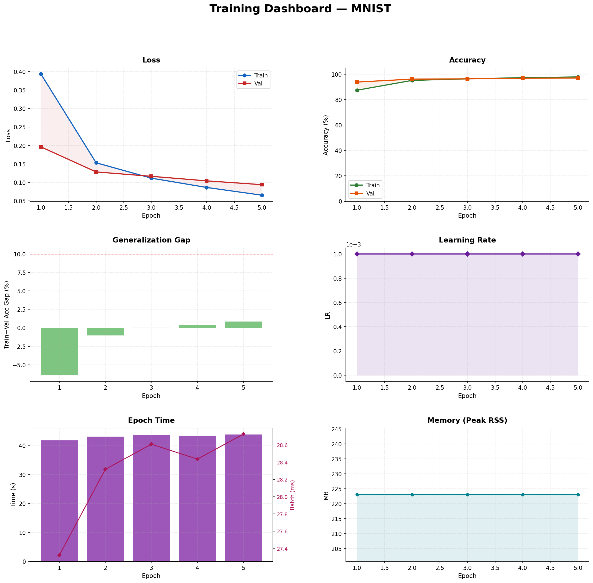

### 9.2 MNIST — Individual Plots

| Loss Curve | Accuracy Curve |
|:---:|:---:|
| 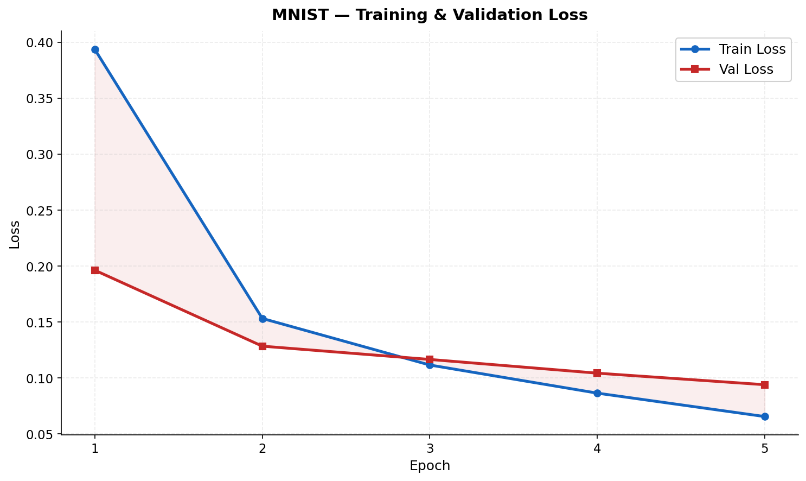 | 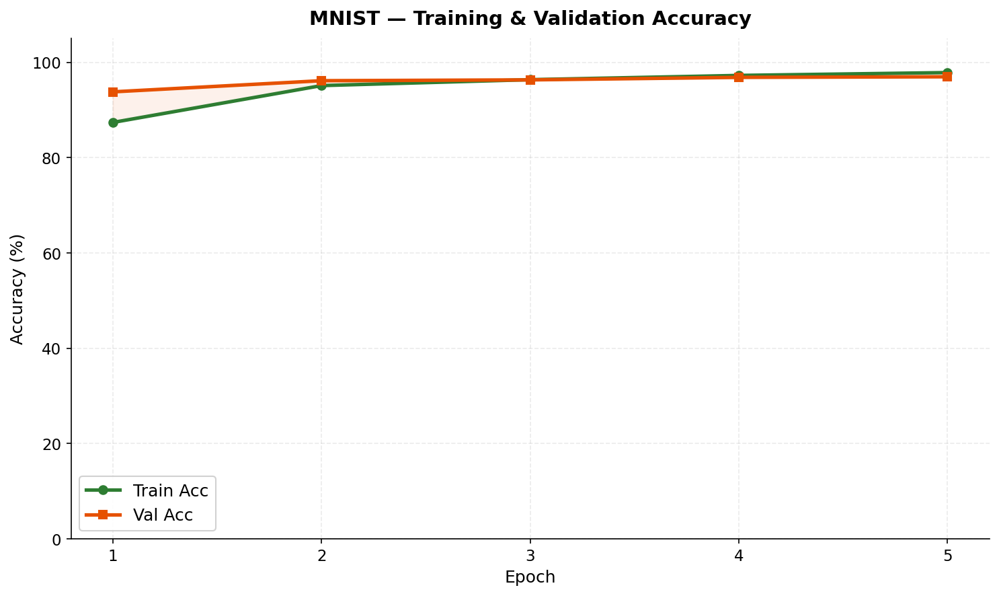 |

| Overfitting Gap | Learning Rate Schedule |
|:---:|:---:|
| 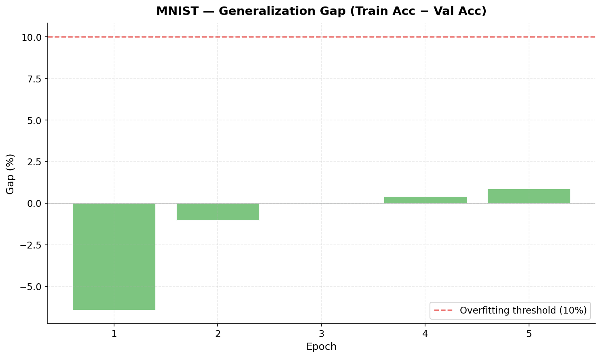 | 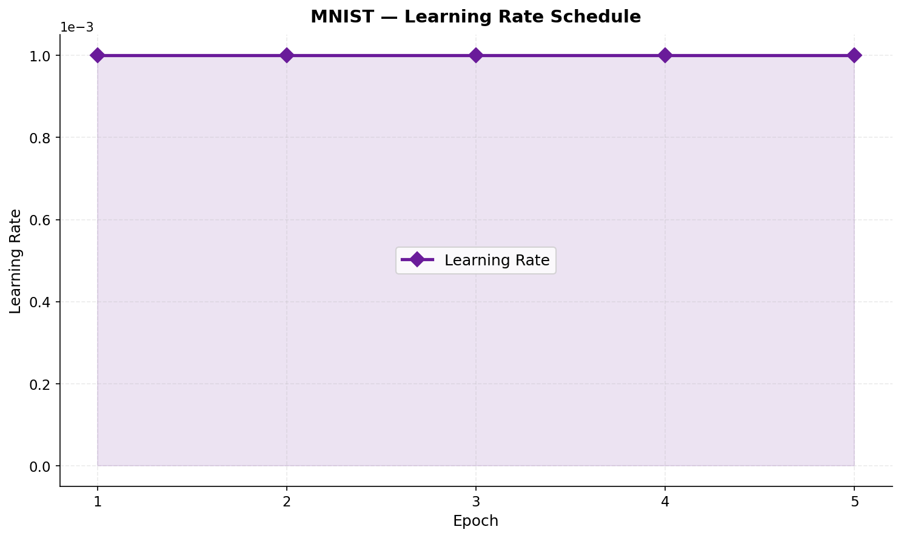 |

| Epoch Time | Memory Usage |
|:---:|:---:|
| 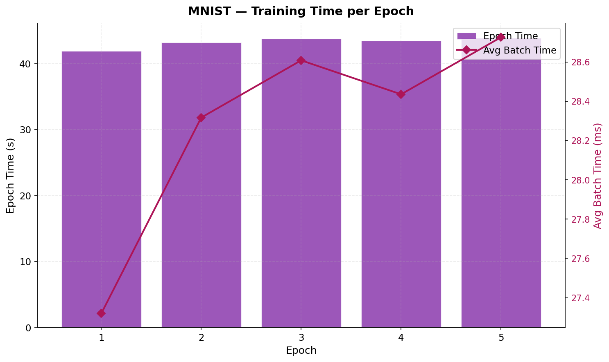 | 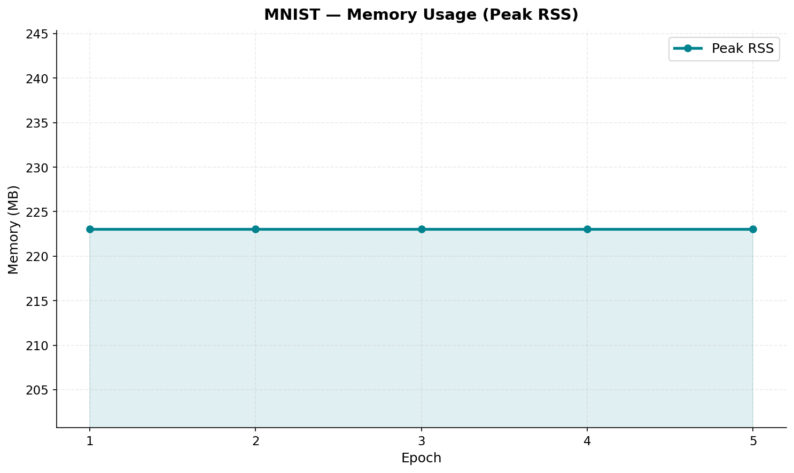 |

| Cumulative Time |
|:---:|
| 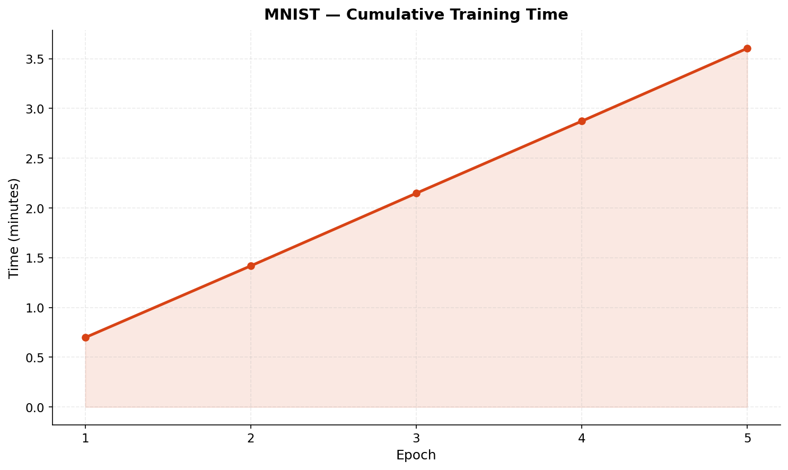 |

### 9.3 CIFAR-100 Training Dashboard

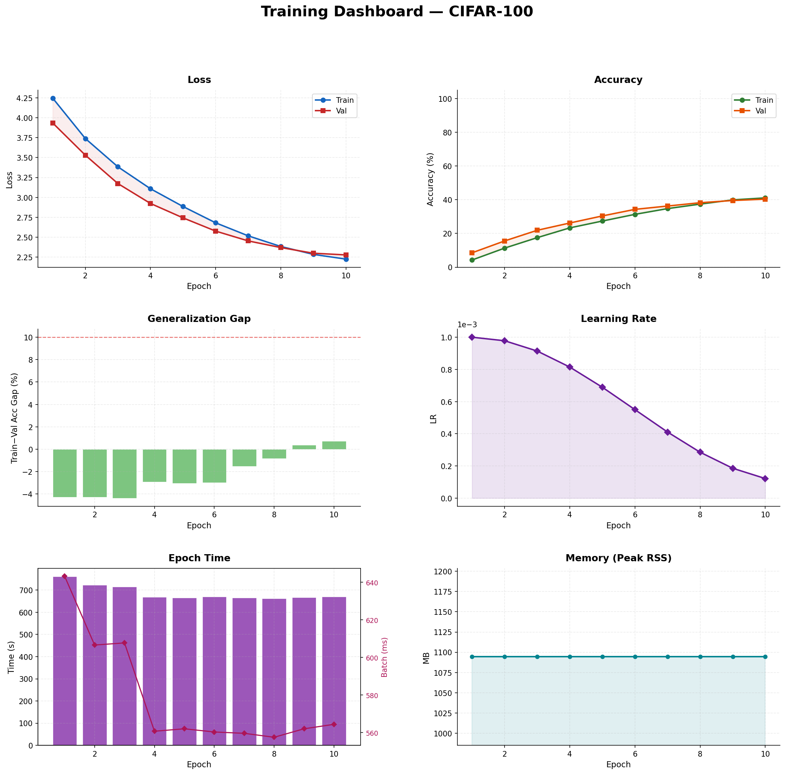

### 9.4 CIFAR-100 — Individual Plots

| Loss Curve | Accuracy Curve |
|:---:|:---:|
| 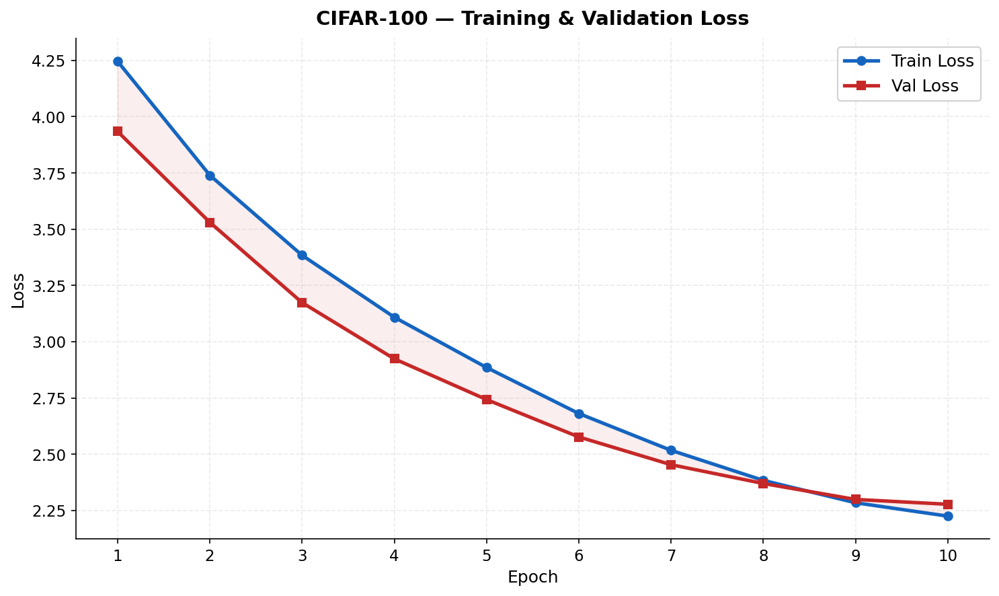 | 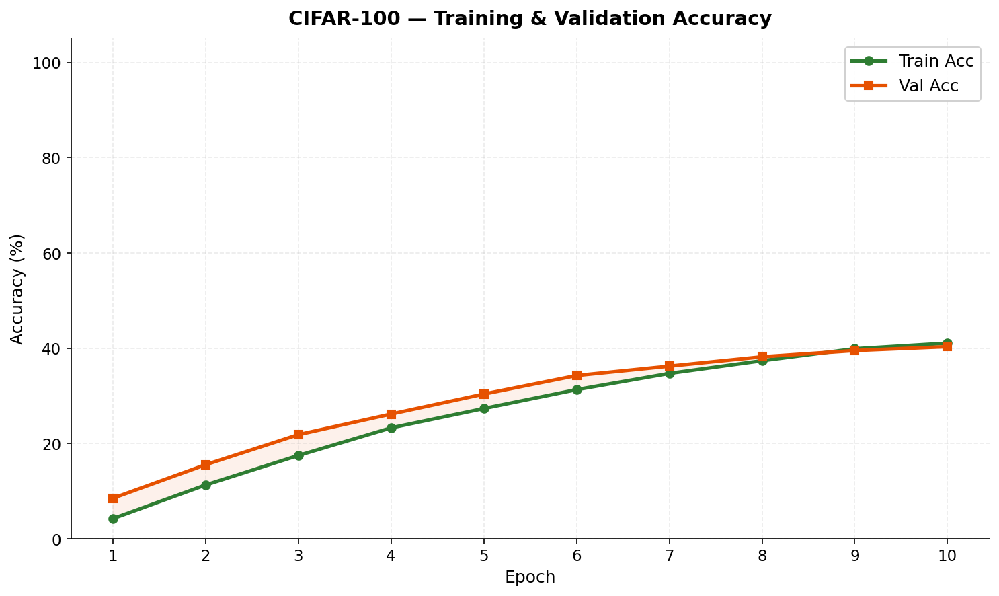 |

| Overfitting Gap | Learning Rate Schedule |
|:---:|:---:|
| 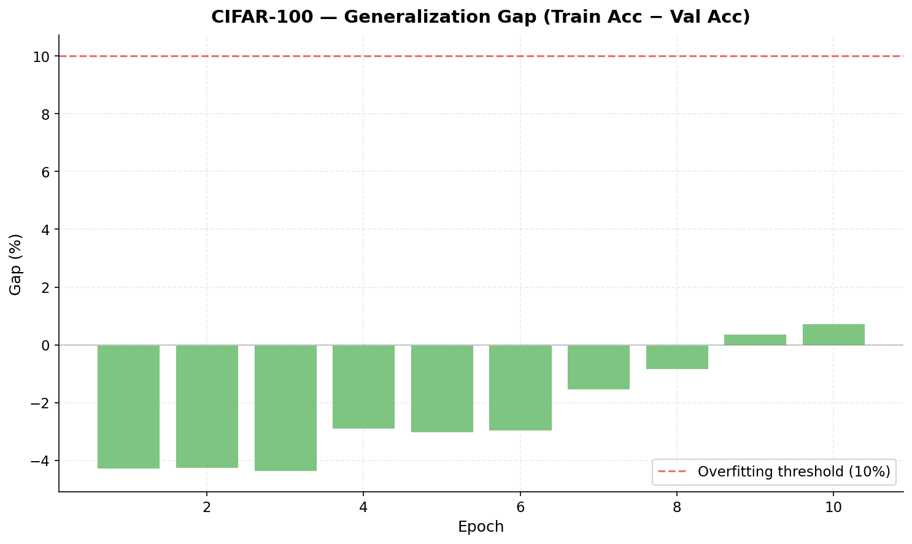 | 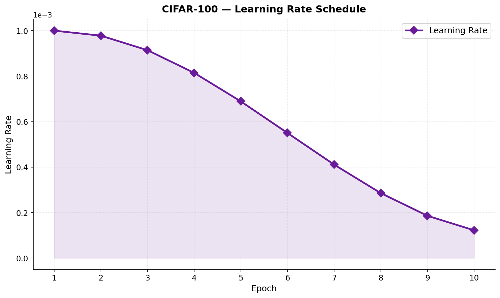 |

| Epoch Time | Memory Usage |
|:---:|:---:|
| 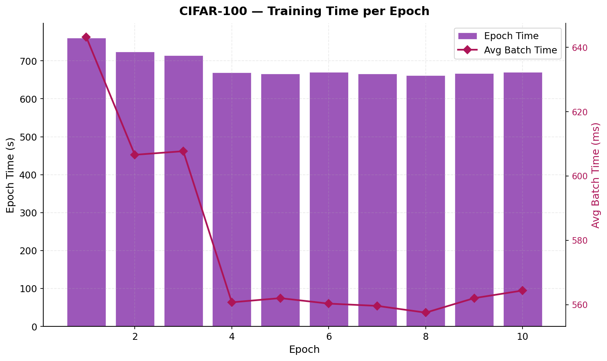 | 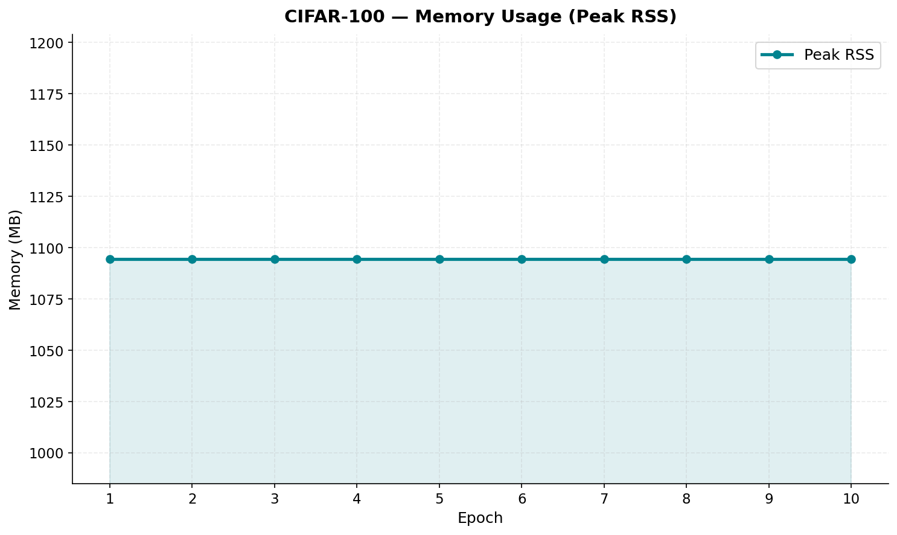 |

| Cumulative Time |
|:---:|
| 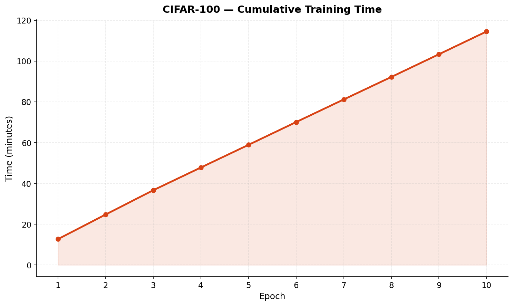 |

---

## 10. Model Complexity Analysis

### 10.1 Parameter Distribution

**MNIST Model:**

| Layer | Parameters | % of Total |
|-------|-----------|-----------|
| conv1 | 150 | 0.24% |
| conv2 | 2,400 | 3.89% |
| fc1 | 48,120 | 78.01% |
| fc2 | 10,164 | 16.47% |
| fc3 | 850 | 1.38% |
| **Total** | **61,684** | **100%** |

**CIFAR-100 Model:**

| Layer | Parameters | % of Total |
|-------|-----------|-----------|
| conv1 | 864 | 0.25% |
| conv2 | 9,216 | 2.67% |
| conv3 | 18,432 | 5.34% |
| conv4 | 36,864 | 10.68% |
| conv5 | 73,728 | 21.35% |
| conv6 | 147,456 | **42.71%** |
| gap | 0 | 0% |
| fc1 | 33,024 | 9.56% |
| fc2 | 25,700 | 7.44% |
| **Total** | **345,284** | **100%** |

> **Key Insight:** With Global Average Pooling replacing Flatten, the parameter distribution is now dominated by the convolutional layers (82.99%) rather than FC layers (17.01%). The largest single layer is `conv6` at 42.71%, compared to the original architecture where `fc1` alone held 92% of all parameters. This is a much healthier distribution for learning generalizable features.

### 10.2 Computational Cost (MACs/FLOPs)

| Model | MACs | FLOPs | Parameters |
|-------|------|-------|-----------||
| MNIST (LeNet) | 416.5K | 833.0K | 61.7K |
| CIFAR-100 (Mini-VGG + GAP) | 38.69M | 77.38M | 345K |
| Ratio (CIFAR/MNIST) | 92.9× | 92.9× | 5.6× |

The CIFAR model requires ~93× more computation per forward pass than MNIST due to the deeper 3-block architecture with 128 channels. However, the parameter ratio is only 5.6×, demonstrating the efficiency of Global Average Pooling — the added convolutional layers share weights spatially and contribute compute but very few parameters relative to the old FC-heavy architecture.

---

## 11. Performance vs. Computational Trade-offs

| Metric | MNIST | CIFAR-100 |
|--------|-------|-----------|
| Test Accuracy | 96.83% | 40.03% |
| Parameters | 61.7K | 345K |
| FLOPs/sample | 833K | 77.4M |
| Training Time | 3.6 min | 114.5 min |
| Avg Batch Time | 29ms | 560ms |
| Peak Memory | 223 MB | 1,094 MB |
| Accuracy/Param | 0.00157%/param | 0.000116%/param |
| Accuracy/MFLOP | 116.3%/MFLOP | 0.52%/MFLOP |

The MNIST model achieves excellent parameter efficiency (0.00157% accuracy per parameter). The CIFAR-100 model's parameter efficiency improved 3.3× compared to the original 2-block Flatten architecture (0.000116% vs 0.000035% accuracy/param) thanks to Global Average Pooling eliminating the FC bottleneck, while maintaining comparable accuracy (~40%).

---

## 12. Failed Design Decision: No Dropout or Regularization in Initial CIFAR Training

### What was tried
In the initial CIFAR-100 training runs, the model was trained **without any regularization** — no dropout, no data augmentation, and no weight decay. The bare Mini-VGG architecture was trained with a fixed learning rate.

### What happened
The model exhibited severe overfitting:

| Metric | Without Regularization | With Regularization |
|--------|----------------------|---------------------|
| Final Train Accuracy | **86.31%** | 41.08% |
| Best Val Accuracy | 35.91% | **40.34%** |
| Generalization Gap | **+53.0%** (train >> val) | **0.74%** (train ≈ val) |

Without regularization, the training accuracy climbed to 86% while validation accuracy plateaued around 35% — a massive 53-percentage-point generalization gap. The model memorized the training data rather than learning generalizable features.

### Why it failed
With over 1M parameters and only 35,000 training images (350 per class for 100 classes), the model had far more capacity than needed. Without any regularization, the high-dimensional parameter space allowed the network to develop co-adapted features that perfectly fit the training set but failed to generalize.

### What was changed
Four complementary techniques were introduced:

1. **Global Average Pooling** replacing Flatten — reduces parameters from 1.14M to 345K, eliminating the FC bottleneck
2. **Dropout (p=0.3)** after the FC layer — forces redundant feature learning
3. **Data augmentation** (random crop with padding + horizontal flip) — effectively increases dataset diversity
4. **AdamW weight decay (λ=1e-4)** — penalizes large weights
5. **Cosine LR annealing** — smooth decay enables fine-grained convergence

These changes improved validation accuracy from 35.91% to 40.34% while reducing the generalization gap from +53% to just 0.74%, confirming that the original failure was caused by insufficient regularization and an over-parameterized FC layer.

---

## 13. Key Insights

### 13.1 C++ Backend Performance
Implementing the computational backend in C++ with optimizations like tiled matrix multiplication and Im2Col convolution was crucial. The framework processes a MNIST epoch in ~43 seconds (1,313 batches × 29ms/batch) and a CIFAR epoch in ~680 seconds (1,094 batches × 560ms/batch). Without the C++ backend, pure Python implementations would be orders of magnitude slower.

### 13.2 Im2Col Convolution Trade-offs
The Im2Col approach converts convolution to matrix multiplication, enabling efficient computation but at the cost of significant memory expansion. For a single CIFAR-100 batch of 32 images through `conv2` (32 input channels, 3×3 kernel, 32×32 output), the column matrix is 32×1024 × 288 = ~9.4M floats (~36 MB). This memory expansion contributes to the higher memory usage on CIFAR-100 (~1.1 GB vs. 223 MB for MNIST).

### 13.3 The 100-Class Challenge
CIFAR-100 with 100 fine-grained classes and only 500 images per class (350 for training) is inherently harder than MNIST (10 classes, ~6,000 images per class). We achieve ~40% test accuracy with a 3-block VGG + GAP architecture using only 345K parameters, which is reasonable without batch normalization or residual connections. For reference, a ResNet-56 with batch normalization typically achieves ~72% on CIFAR-100, highlighting the gap that more advanced techniques (skip connections, batch normalization) would bridge.

### 13.4 Global Average Pooling vs. Flatten
Our initial 2-block architecture used Flatten + fc1(4096→256), placing 92% of all parameters in a single FC layer. An experiment with Global Average Pooling applied directly to the 64-channel output proved too aggressive — 64 features was insufficient for 100 classes, resulting in only ~33% accuracy. Adding a third conv block (128 channels) before GAP gave 128 features, which proved sufficient to match the original accuracy (~40%) while using 3.3× fewer parameters. This demonstrates that GAP requires enough channel depth to work effectively.

### 13.5 Dropout Behavior
With dropout enabled, training accuracy can be slightly lower than validation accuracy, since dropout randomly zeroes 30% of neurons in the FC layer during training, effectively impairing the network. At evaluation time, all neurons are active, giving the full network capacity. In our final model, the generalization gap is only 0.74%, indicating well-calibrated regularization.

### 13.6 Cosine Annealing Effect
Looking at the CIFAR-100 training curve, the learning rate decays from 0.001 to 0.000122 over 10 epochs (10% of initial). The most significant accuracy gains occur in the first 6 epochs while the LR is still relatively high (>0.0005). In the final 4 epochs, the smaller LR fine-tunes the model, adding ~6% to validation accuracy. Using a minimum LR of 10% (rather than 1%) of the initial ensures later epochs still contribute meaningful learning.

---

## 14. Reproducibility

### 14.1 Build & Train Instructions

```bash
# 1. Environment setup
conda env create -f environment.yml
conda activate gnr638_ass

# 2. Build C++ backend
cmake -S . -B build -DPYTHON_EXECUTABLE=$(which python)
cmake --build build

# 3. Train MNIST
python train.py --dataset mnist --data_path data_1 --epochs 5 --lr 0.001

# 4. Train CIFAR-100
python train.py --dataset cifar --data_path data_2 --epochs 10 --lr 0.001 --weight_decay 1e-4

# 5. Evaluate
python test.py --dataset mnist --data_path data_1 --model_path results/models/mnist_model.pkl
python test.py --dataset cifar --data_path data_2 --model_path results/models/cifar_model.pkl

# 6. Generate plots
python plot_metrics.py --log_file results/training_logs/training_log_mnist.csv
python plot_metrics.py --log_file results/training_logs/training_log_cifar.csv
```

### 14.2 Evaluation Script Requirements

The evaluation script (`test.py`) requires only:
- `--dataset`: `mnist` or `cifar`
- `--data_path`: Path to the test dataset (same directory structure as training)
- `--model_path`: Path to the saved model weights (`.pkl` file)

No code modifications are needed for evaluation on hidden test sets.

### 14.3 Deterministic Data Splitting

The data split uses a fixed random seed (`seed=42`) ensuring the same train/val/test division across runs.

---

## 15. Project Structure Summary

```
Assignment_1/
├── CMakeLists.txt              # Build config for C++ backend
├── environment.yml             # Conda environment specification
├── train.py                    # Training entry point
├── test.py                     # Evaluation entry point
├── plot_metrics.py             # Plot generation from training logs
│
├── src/                        # C++ backend source (620+ lines)
│   ├── tensor.cpp              # Tensor class (67 lines)
│   ├── ops.cpp                 # All operations (620 lines)
│   └── bindings.cpp            # pybind11 bindings (77 lines)
│
├── include/                    # C++ headers
│   ├── tensor.hpp              # Tensor class declaration
│   └── ops.hpp                 # Operation function signatures
│
├── python/my_framework/        # Python framework package
│   ├── tensor.py               # Tensor wrapper + autograd engine (248 lines)
│   ├── models.py               # Layer definitions + model architectures (192 lines)
│   ├── optim.py                # SGD + Adam/AdamW optimizers (73 lines)
│   ├── data.py                 # DataLoader with augmentation (111 lines)
│   └── model_utils.py          # Parameter/FLOPs/MACs analysis (206 lines)
│
├── results/
│   ├── models/                 # Saved model weights (.pkl)
│   ├── training_logs/          # CSV logs + model summary text files
│   ├── test_results/           # Per-dataset evaluation results
│   └── plots/                  # 16 training visualization plots
│
└── tests/                      # Unit tests for forward pass & autograd
```

---

## 16. Resources & Citations

1. **LeNet-5:** LeCun, Y., Bottou, L., Bengio, Y., & Haffner, P. (1998). "Gradient-Based Learning Applied to Document Recognition." *Proceedings of the IEEE*, 86(11), 2278–2324.

2. **VGGNet:** Simonyan, K., & Zisserman, A. (2015). "Very Deep Convolutional Networks for Large-Scale Image Recognition." *ICLR 2015*. arXiv:1409.1556.

3. **Kaiming He Initialization:** He, K., Zhang, X., Ren, S., & Sun, J. (2015). "Delving Deep into Rectifiers: Surpassing Human-Level Performance on ImageNet Classification." *ICCV 2015*. arXiv:1502.01852.

4. **Adam Optimizer:** Kingma, D. P., & Ba, J. (2015). "Adam: A Method for Stochastic Optimization." *ICLR 2015*. arXiv:1412.6980.

5. **AdamW (Decoupled Weight Decay):** Loshchilov, I., & Hutter, F. (2019). "Decoupled Weight Decay Regularization." *ICLR 2019*. arXiv:1711.05101.

6. **Dropout:** Srivastava, N., Hinton, G., Krizhevsky, A., Sutskever, I., & Salakhutdinov, R. (2014). "Dropout: A Simple Way to Prevent Neural Networks from Overfitting." *JMLR*, 15, 1929–1958.

7. **Cosine Annealing LR:** Loshchilov, I., & Hutter, F. (2017). "SGDR: Stochastic Gradient Descent with Warm Restarts." *ICLR 2017*. arXiv:1608.03983.

8. **Im2Col Convolution:** Chellapilla, K., Puri, S., & Simard, P. (2006). "High Performance Convolutional Neural Networks for Document Processing." *ICDAR Workshop*.

9. **pybind11:** Jakob, W. et al. "pybind11 — Seamless operability between C++11 and Python." https://github.com/pybind/pybind11

10. **OpenCV:** Bradski, G. (2000). "The OpenCV Library." *Dr. Dobb's Journal of Software Tools*. https://opencv.org

11. **AI Tools Used:** Google Gemini (coding assistant) was used for debugging, code suggestions, and report drafting assistance.

---
